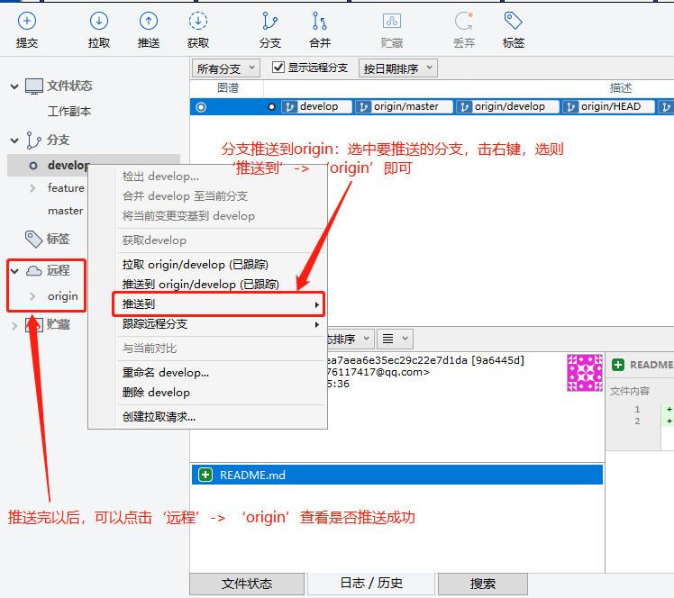
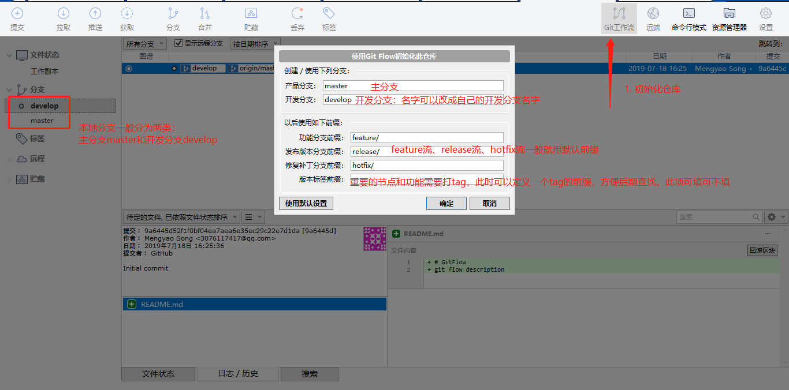
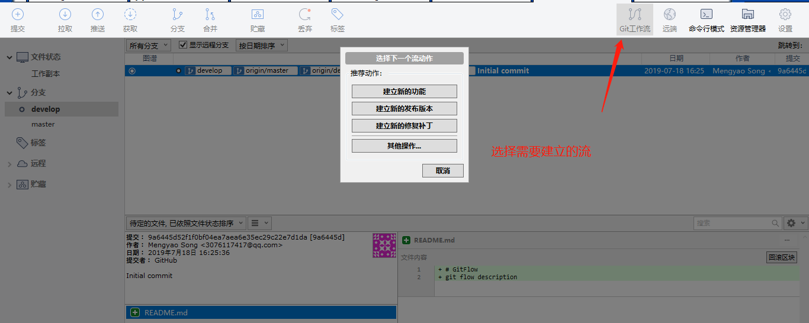
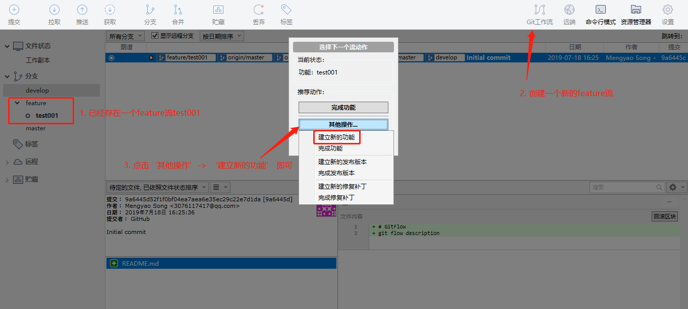
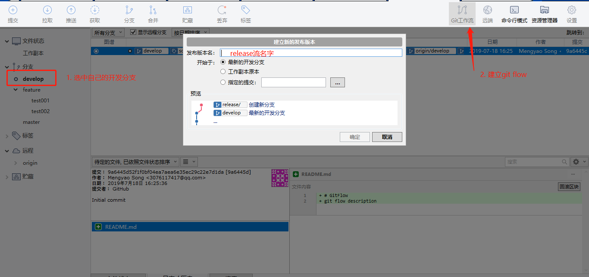
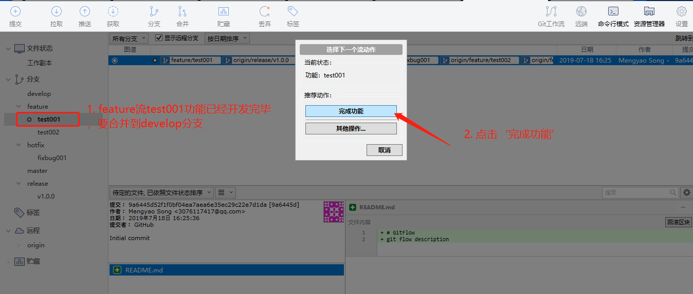

[返回目录](../git常用操作.md)

## git flow (git 工作流) 详解

git流有三种：feature(功能)、release(发布)、hotfix(修bug)。`feature分支可以同时存在多个，release和hotfix只能存在一个`

1. 为什么要用git工作流？
    - 不污染已经稳定运行的分支
    - 项目迭代过多时，方便多人协作
2. git工作流的详细用法

    `建立的流分支，要记得推送到origin`
    

    - sourceTree(图形管理工具) 用法：

      (1). 初始化仓库
      
      (2). 建立流
      
      (3). 建立 feature 流 (功能流，同时可以建立多个)
      
      
      (4). 建立 hotfix 流 (修改bug流，一次只能建立一个，是建立在 master 分支上的)
      .jpg)
      (5). 建立 release 流 (发布版本流，一次只能建立一个)
      
      (6). 完成某个流上面的任务后，要合并code到开发分支。比如合并feature流：
      
      

    - git 命令 用法：

[返回目录](../git常用操作.md)
