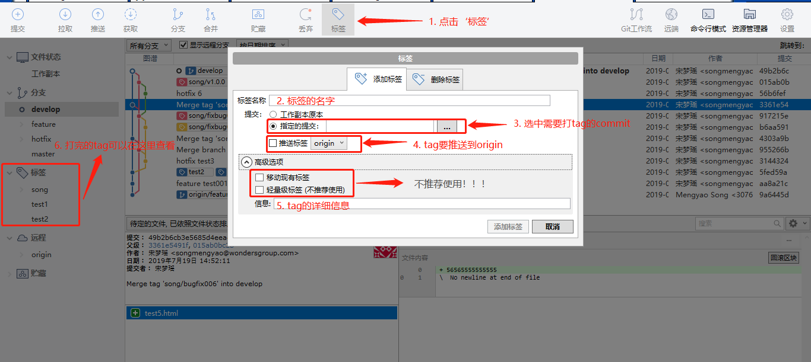

[返回目录](../git常用操作.md)

## git tag (标签) 详解

git的标签分为两种：`轻量标签 和 附注标签`，一般打的标签默认都是附注标签 (建议使用 附注标签)。轻量标签是指向提交对象的引用，附注标签则是仓库中的一个独立对象。

1. 为什么使用 tag？
    - 标记重要节点和功能
    - 管理版本的发布
2. git tag 的详细用法
    - sourceTree (图形管理工具) 用法：

    
    
    - git 命令 用法：

[返回目录](../git常用操作.md)
