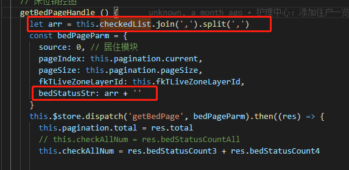

1. 生命周期函数

2. filters过滤器

3. 自定义指令

4. 父子组件、兄弟组件传参

5. computed和watch
https://www.cnblogs.com/gunelark/p/8492468.html

9. provide和inject

6. vue-router：
    - 路由守卫
    - 路由懒加载
    - history模式
    - 路由传参

7. vuex：
    - Getters
    - Actions
    - Mutaions
    - State
    - Dispatch
    - Module
    - 热重载

8. vue-cli：
    - webpack相关配置(属于node)
    - css相关配置
    - 构建
    - 部署

9. get请求传的参数中数组，类似[1, 2, 3]，做如下处理：

10. [vue-ls](./vue/vue-ls/vue-ls.md)
