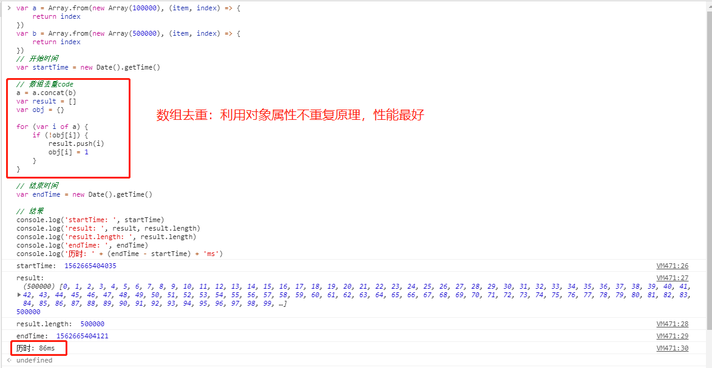
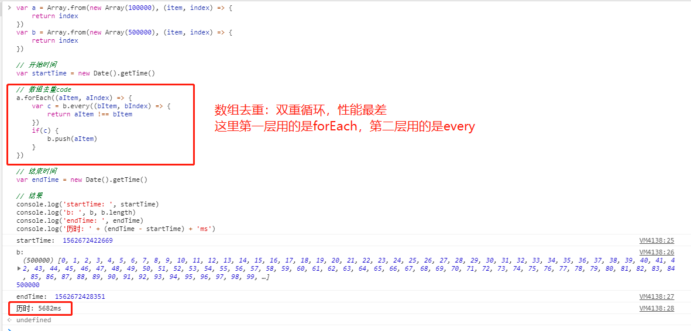
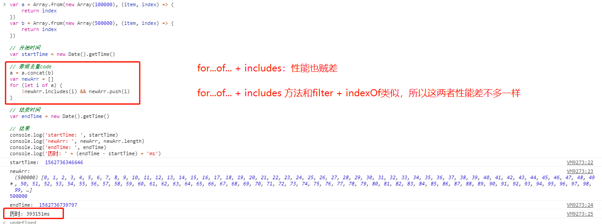
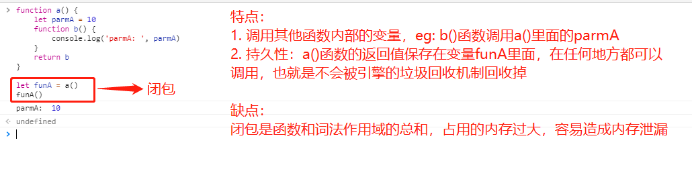

1. **` 数组去重(共 6 种方法，性能：逐个递减) `**
   
    用下面代码创建两个数组：
    ```
      var a = Array.from(new Array(100000), (item, index) => {
        return index
      })
      var b = Array.from(new Array(500000), (item, index) => {
        return index
      })
    ```
    其中a数组的长度为a.length = 100000，b数组的长度为b.length = 500000

    用下面代码计算数组去重所用时间：
    ```
      var startTime = new Date().getTime()
      // 数组去重code
      var endTime = new Date().getTime()

      var timeDiff = endTime - startTime
      console.log('历时: ' + timeDiff + 'ms')
    ```

    用下面方法进行数组去重：
    - (1). 利用对象的属性不会重复这一特性，校验数组元素是否重复：
      ```
        var a = Array.from(new Array(100000), (item, index) => {
          return index
        })
        var b = Array.from(new Array(500000), (item, index) => {
          return index
        })
        // 开始时间
        var startTime = new Date().getTime()

        // 数组去重code
        a = a.concat(b)
        var result = []
        var obj = {}

        for (var i of a) {
          if (!obj[i]) {
              result.push(i)
                obj[i] = 1
            }
        }

        // 结束时间
        var endTime = new Date().getTime()

        // 结果
        console.log('startTime: ', startTime)
        console.log('result: ', result, result.length)
        console.log('result.length: ', result.length)
        console.log('endTime: ', endTime)
        console.log('历时: ' + (endTime - startTime) + 'ms')
      ```
      结果如下图：
      

    - (2). 使用 sort() 将数组进行排序，然后比较相邻元素是否相等去重：(原因：只做了一次排序和一次循环)
      ```
        var a = Array.from(new Array(100000), (item, index) => {
          return index
        })
        var b = Array.from(new Array(500000), (item, index) => {
          return index
        })

        // 开始时间
        var startTime = new Date().getTime()

        // 数组去重code
        a = a.concat(b)
        a = a.sort()
        var result = [a[0]]

        for (var i=1, len=a.length; i<len; i++) {
          a[i] !== a[i-1] && result.push(a[i])
        }

        // 结束时间
        var endTime = new Date().getTime()

        // 结果
        console.log('startTime: ', startTime)
        console.log('result: ', result, result.length)
        console.log('endTime: ', endTime)
        console.log('历时: ' + (endTime - startTime) + 'ms')
      ```
      结果如下图：
      


    - (3). es6的new Set方法去重：
      ```
        var a = Array.from(new Array(100000), (item, index) => {
          return index
        })
        var b = Array.from(new Array(500000), (item, index) => {
          return index
        })

        // 开始时间
        var startTime = new Date().getTime()

        // 数组去重code
        a = a.concat(b)
        var newArr = [...new Set(a)]
        // var newArr = Array.from(new Set(a))

        // 结束时间
        var endTime = new Date().getTime()

        // 结果
        console.log('startTime: ', startTime)
        console.log('newArr: ', newArr, newArr.length)
        console.log('endTime: ', endTime)
        console.log('历时: ' + (endTime - startTime) + 'ms')
      ```
      结果如下图：
      

    - (4). 双重循环去重(循环层越多，性能越差; 如果把a和b的长度换一下，历时会更长，大概200000ms)：
      ```
        var a = Array.from(new Array(100000), (item, index) => {
          return index
        })
        var b = Array.from(new Array(500000), (item, index) => {
          return index
        })

        // 开始时间
        var startTime = new Date().getTime()

        // 数组去重code
        a.forEach((aItem, aIndex) => {
          var c = b.every((bItem, bIndex) => {
              return aItem !== bItem
            })
            if(c) {
                b.push(aItem)
            }
        })

        // 结束时间
        var endTime = new Date().getTime()

        // 结果
        console.log('startTime: ', startTime)
        console.log('b: ', b, b.length)
        console.log('endTime: ', endTime)
        console.log('历时: ' + (endTime - startTime) + 'ms')
      ```
      结果如下图：
      

    - (5). filter + indexOf去重 (和for...of... + includes性能差不多，因为原理类似)：
      ```
        var a = Array.from(new Array(100000), (item, index) => {
          return index
        })
        var b = Array.from(new Array(500000), (item, index) => {
            return index
        })

        // 开始时间
        var startTime = new Date().getTime()

        // 数组去重code
        a = a.concat(b)
        var newArr = a.filter((item, index)=> {
          return a.indexOf(item) === index
        })

        // 结束时间
        var endTime = new Date().getTime()

        // 结果
        console.log('startTime: ', startTime)
        console.log('newArr: ', newArr, newArr.length)
        console.log('endTime: ', endTime)
        console.log('历时: ' + (endTime - startTime) + 'ms')
      ```
      结果如下图：
      

    - (6). for...of... + includes去重 (和filter + indexOf性能差不多，因为原理类似)：
      ```
        var a = Array.from(new Array(100000), (item, index) => {
          return index
        })
        var b = Array.from(new Array(500000), (item, index) => {
            return index
        })

        // 开始时间
        var startTime = new Date().getTime()

        // 数组去重code
        a = a.concat(b)
        var newArr = []
        for (let i of a) {
          !newArr.includes(i) && newArr.push(i)
        }

        // 结束时间
        var endTime = new Date().getTime()

        // 结果
        console.log('startTime: ', startTime)
        console.log('newArr: ', newArr, newArr.length)
        console.log('endTime: ', endTime)
        console.log('历时: ' + (endTime - startTime) + 'ms')
      ```
      结果如下图：
      

---

2. 闭包

    - (1). js为什么有闭包？

         闭包并不是一个需要学习新的语法或模式才能使用的工具，闭包是基于`词法作用域书写代码时所产生的自然结果`，你甚至不需要为了利用它们而有意识地创建闭包。闭包的创建和使用在你的代码中随处可见。你缺少的是根据你自己的意愿来识别、拥抱和影响闭包的思维环境。
    - (2). js的闭包是什么？

        当函数记住并且可以访问所在的词法作用域时，就产生了闭包。`如果将函数(访问自己的词法作用域)当做第一级的值类型并且到处传递，这就是闭包。`
        
    - (3). js闭包的作用？

        - 闭包是连接函数内部和外部的桥梁
        - 闭包可以阻止垃圾的回收机制
    - (4). 闭包的列子

      - 词法作用域规则(只是闭包的一部分)
      ```
      function foo() {
        var a = 2;
        function bar() {
          console.log( a );  // 2
        }
        bar();
      }
      foo();
      ```
      - 闭包列子：
      ```
      列1、
        function foo() {
          var a = 2
          function bar() { 
            console.log( a )
          }
          return bar
        }
        var baz = foo()
        baz()  // 2
      ```
      ```
      列2、
        function foo() {
          var a = 2;
          function baz() {
            console.log( a ); // 2
          }
          bar( baz );
        }
        function bar(fn) {
          fn(); // 闭包
        }
      ```
      ```
      列3、
        var fn;
        function foo() {
          var a = 2;
          function baz() {
            console.log( a );
          }
          fn = baz; // 将 baz 分配给全局变量
        }
        function bar() {
          fn(); // 闭包
        }
        foo();
        bar(); // 2
      ```
      ```
      列4、
        function wait(message) {
          setTimeout( function timer() {
            console.log( message );
          }, 1000 );
        }
        wait( "Hello, World!" );
      ```
      列5、
      

---

3. 原型 & 原型链 & 原型对象

---

4. 数组遍历

5. 操作数组的方法，eg: split

6. 操作字符串的方法，eg: splice

7. 递归

8. 深度优先递归法（树）

9. 广度优先递归法（树）

10. 日期，eg: 年月日、时分秒

11. js数据类型

12. 构造函数

13. js继承

14. js数学方法

15. js比较

16. js类型转换、隐式转换、弱引用类型

17. js异常

18. js正则表达式

19. js性能

20. 单向数据流

21. bind

22. call

23. apply

24. 函数柯里化

25. 高阶函数

26. 变量提升

    js中的变量可以先使用，在声明。`函数及变量的声明都将被提升到函数的最顶部。` eg：
    ```
      x = 10 // 使用
      console.log('x: ', x)  // x: 10
      var x // 声明
    ```
    `js只有声明的变量会提升，初始化的不会。` eg：
    ```
      列1、
      x = 10
      y = 5
      console.log('x, y, x + y: ', x, y, x + y)  // 10, 5, 15
      var x // 声明
      var y = 15 // 初始化y
    ```
    ```
      列2、
      a = 1
      document.write('a 是: ', a) // 1
      document.write('b 是: ', b) // undefined
      var a  // 声明a
      var b = 2 // 初始化b
    ```

---

27. es6中的 `Proxy`

28. 深拷贝

29. js 防抖 & 节流

30. '==' 和 '==='
