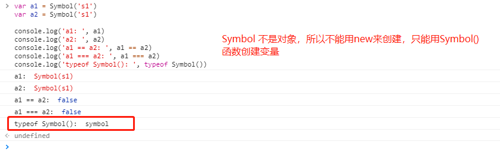

[返回目录](../原生JS.md)

**` js 数据类型 `**

js 的数据类型分为 `基本数据类型` 和 `引用类型`。如下：
  - 基本数据类型 (`6种`)：字符String、数字Number、布尔Boolean、undefined、null、Symbol
  - 引用类型 (`3种`)：对象Object、数组Array、函数Function

  其中`undefined表示无值，null表示不存在`。但是js认为null的typeof是Object，这是一个bug的存在。

  Symbol是es6中提供的一个新数据类型，意思是标记、符号，`代表独一无二的值`。eg: 
  
  

  `JavaScript 变量均为对象`。当声明一个变量时，就创建了一个新的对象。eg: 
  ```
    var a = new String
    var b = new Number
    var c = new Boolean
    var d = new Array
    var e = new Object
    var f = new Function
  ```
  js 中的对象分为两种：`普通对象 和 函数对象`。凡是通过new Function创建的变量都是函数对象，其余的都是普通对象。

[返回目录](../原生JS.md)
