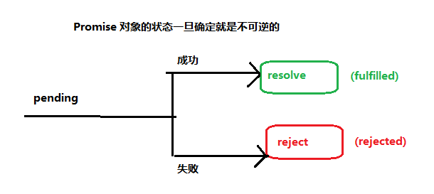

[返回目录](../原生JS.md)

**` promise `**

1. 为什么会有promise？
    - 用来解决 回调地狱
2. promise 对象

    在Promise中无论是then还是catch方法，都会返回返回一个新的Promise对象。
    ```
      new Promise((resolve, reject) => {
        getData(parm).then(rest => {
          resolve(rest)
        }).catch(error => {
          reject(error)
        })
      })
    ```
3. promise 状态

    `promise 有三种状态，并且只要状态一确定，就是不可逆的。`
    - Pending: 进行中
    - Fulfilled: 成功
    - Rejected: 失败

    
4. promise 方法
    - Promise.all()
    - Promise.race()
    - Promise.resolve()
    - Promise.reject()
    - Promise.prototype.then()
    - Promise.prototype.catch()
    - Promise.prototype.finally()
5. promise 源码分析
  ```
    源码大概逻辑：
    function 函数名(){
      return new Promise(function(resolve, reject) {
        // ... some code
        if (/* 异步操作成功 */){
          resolve(value); // 异步操作成功时调用，把结果作为参数传递出去
        } else {
          reject(error); // 异步失败时调用，把错误作为参数传递出去
        }

      })
    }
  ```

[返回目录](../原生JS.md)
