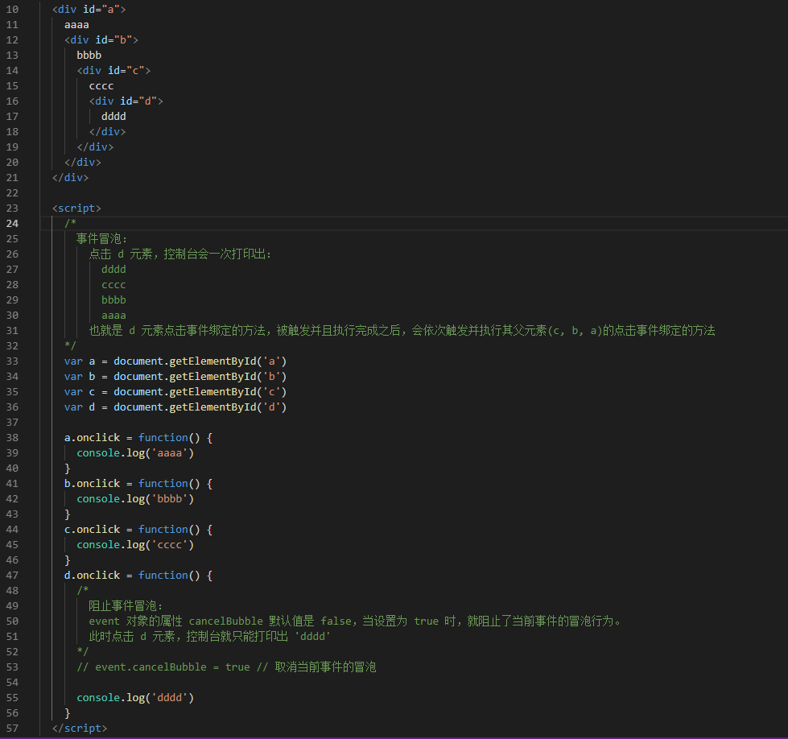
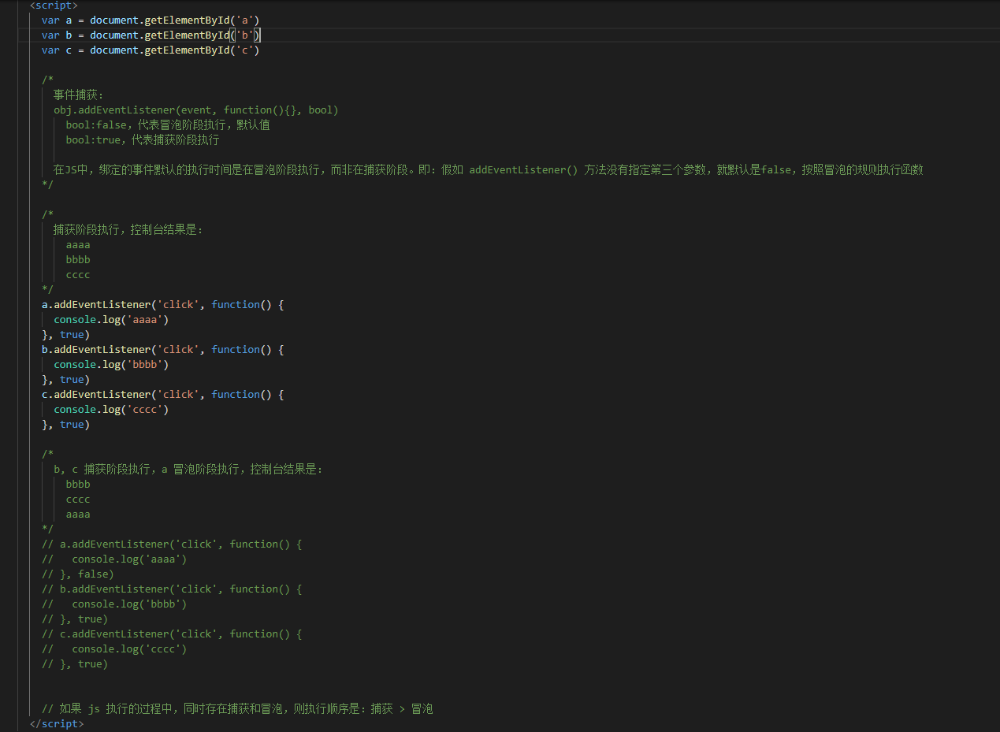

[返回目录](../原生JS.md)

**` 事件冒泡 和 事件捕获 `**

1. 事件
  - 定义：浏览器客户端上，客户触发的事件，都称为事件。事件都是天生自带的，不需要我们去定义，我们只需要去触发。例如：

    `onmouseover, onmouseout, onmousedown, onmousemove, onmouseup, onclick, onchange, onfocus, onblur, 等...`

2. 事件冒泡
  - 定义：当给父元素和子元素同样的事件绑定方法时，触发子元素的事件，子元素的方法执行完之后，事件会向上冒泡，依次触发父元素相同的事件
  - 阻止冒泡：Event对象有个属性叫 cancelBubble ，默认值是false，改成true就取消了当前事件的冒泡，eg:

    

    代码：[事件冒泡 code demo](./code/bubble.html)
  
3. 事件捕获
  - 定义： 父元素和子元素，用 addEventListener() 绑定同样的事件，当触发子元素的事件时，会先触发父元素的事件，然后父元素再传递给子元素
  - 低版本的 ie 浏览器没有事件捕获
  - 事件捕获例子：

    

    代码：[事件捕获 code demo](./code/capture.html)

4. attachEvent() 和 addEventListener() 二者区别：
  - attachEvent 只用在iE8以下，addEventListener() 适合标准浏览器
  - attachEvent 的事件名带 on，而 addEventListener 事件名不带 on
  - attachEvent 函数里面的 this 是 window，而 addEventListener 函数里面的 this 是当前元素对象
  - attachEvent 只有冒泡没有捕获，addEventListener 有冒泡也有捕获

`注意：通过 addEventListenter() 添加的方法，必须通过 removeEventLister() 解除`

[返回目录](../原生JS.md)