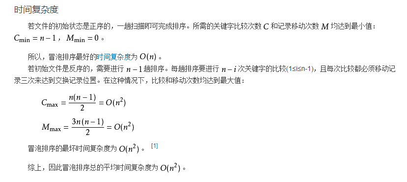

[返回目录](../原生JS.md)

**` 冒泡排序法 `**

- 冒泡排序 定义：

  冒泡排序（Bubble Sort），是一种较简单的排序算法。它重复地走访过要排序的元素列，依次比较两个相邻的元素，如果他们的顺序（如从大到小、首字母从A到Z）错误就把他们交换过来。走访元素的工作是重复地进行直到没有相邻元素需要交换，也就是说该元素列已经排序完成。

- 冒泡排序 名字的由来：
  
  这个算法的名字由来是因为越大的元素会经由交换慢慢“浮”到数列的顶端`（升序或降序排列）`，就如同碳酸饮料中二氧化碳的气泡最终会上浮到顶端一样，故名“冒泡排序”。

- 冒泡排序 算法原理：
  1. 比较相邻的元素。如果第一个比第二个大，就交换他们两个。
  2. 对每一对相邻元素做同样的工作，从开始第一对到结尾的最后一对。在这一点，最后的元素应该会是最大的数。
  3. 针对所有的元素重复以上的步骤，除了最后一个。
  4. 持续每次对越来越少的元素重复上面的步骤，直到没有任何一对数字需要比较。

- 冒泡排序 算法分析：
  1. 时间复杂度：(关键字比较次数C和记录移动次数M)
  
  2. 算法稳定性：

      `冒泡排序就是把小的元素往前调或者把大的元素往后调`。比较是相邻的两个元素比较，交换也发生在这两个元素之间。所以，如果两个元素相等，是不会再交换的；如果两个相等的元素没有相邻，那么即使通过前面的两两交换把两个相邻起来，这时候也不会交换，所以相同元素的前后顺序并没有改变，所以冒泡排序是一种稳定排序算法。

- 冒泡排序 code eg:
```
  function bubbleSort(arr) {
    var i = arr.length, j;
    var tempExchangVal;
    while (i > 0) {
      for (j = 0; j < i - 1; j++) {
        if (arr[j] > arr[j + 1]) {
          tempExchangVal = arr[j];
          arr[j] = arr[j + 1];
          arr[j + 1] = tempExchangVal;
        }
      }
      i--;
    }
    return arr;
  }
  
  var arr = [3, 2, 4, 9, 1, 5, 7, 6, 8];
  var arrSorted = bubbleSort(arr);
  console.log(arrSorted);
```

```
  function bubbing() {
    for (let i = 0; i < a.length; i++) {
      for (let j = i + 1; j < a.length; j++) {
        if (a[i] > a[j]) {
          let temp = a[i];
          a[i] = a[j];
          a[j] = temp;
        }
      }
    }
    return a;
  }
```

[返回目录](../原生JS.md)
