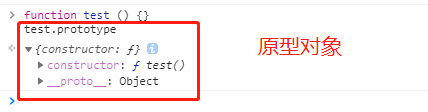

[返回目录](../原生JS.md)

**` 原型对象 & 原型链 `**
1. 原型对象
  - 原型对象是什么？

    当一个函数被创建之后，就会有一个`prototype`的属性，不仅仅是构造函数，普通函数也有。这个属性的值是一个对象，这个对象就是原型对象。比如：

    

    `如果该函数是构造函数，原型对象里面创建的方法和属性，可以被该构造函数的实例调用。`构造函数的每一个实例都有一个__proto__属性，指向构造函数的prototype原型对象。

  - 为什么要使用原型对象 以及 如何使用原型对象？

    原因：`避免内存空间的浪费`。比如现在有个构造函数，如下：
    ```
    function Person (name, age, sex, hobby) {
      this.name = name
      this.age = age
      this.sex = sex
      this.hobby = hobby
      this.say = function () {
        console.log('hello')
      }
    }

    var p1 = new Person('song', 24, '女', 'dancing')
    var p2 = new Person('meng', 18, '男', 'football')
    var p3 = new Person('yao', 20, '女', 'running')
    ...

    console.log('p1: ', p1)
    console.log('p2: ', p2)
    console.log('p3: ', p3)
    ```
    假如现在创建100个实例，也就是说创建了100个内存空间，每个内存空间都有自己的say方法，但是这个say方法其实功能是一样的，完成了一件事，但是却占用了100个内存空间，此时如果把这个say方法，放到这个构造函数Person的原型对象Person.prototype中，这样就只占用一块内存，同时不同实例的__proto__属性就指向同一块内存地址，也就相等了。代码如下：
    ```
    原型对象使用方法：
    function Person (name, age, sex, hobby) {
      this.name = name
      this.age = age
      this.sex = sex
      this.hobby = hobby
    }

    Person.prototype.say = function () {
      console.log('hello')
    }

    var p1 = new Person('song', 24, '女', 'dancing')
    var p2 = new Person('meng', 18, '男', 'football')
    var p3 = new Person('yao', 20, '女', 'running')

    console.log('p1: ', p1)
    console.log('p2: ', p2)
    console.log('p3: ', p3)
    console.log('Person.prototype == p1.__proto__', Person.prototype == p1.__proto__)  // true
    console.log('Person.prototype == p2.__proto__', Person.prototype == p2.__proto__)  // true
    console.log('Person.prototype == p3.__proto__', Person.prototype == p3.__proto__)  // true
    console.log('p1.__proto__ == p2.__proto__', p1.__proto__ == p2.__proto__)  // true
    console.log('p2.__proto__ == p3.__proto__', p2.__proto__ == p3.__proto__)  // true
    console.log('p2.__proto__ == p1.__proto__', p2.__proto__ == p1.__proto__)  // true
    ```

  - 原型对象的总结
      - 一个函数创建好之后，就会有一个 prototype 属性，这个属性的值是一个对象，我们把这个 prototype 属性所指向的内存空间称为这个函数的原型对象
      - 某个函数的原型对象会有一个 constructor 属性，这个属性指向该函数本身。eg：
      ```
      function Person() {}
      console.log(Person.prototype.constructor === Person)  // true
      ```
      - 当某个函数当成构造函数来调用时，就会产生一个构造函数的实例。这个实例上会拥有一个 __proto__ 属性，这个属性指向该实例的构造函数的原型对象(也可以称为该实例的原型对象)。eg：
      ```
      function Person() {}
      var p1 = new Person()
      console.log(p1.__proto__ === Person.prototype)  // true
      ```


[返回目录](../原生JS.md)
