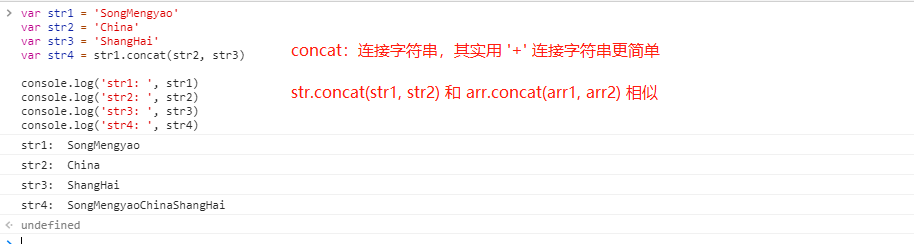
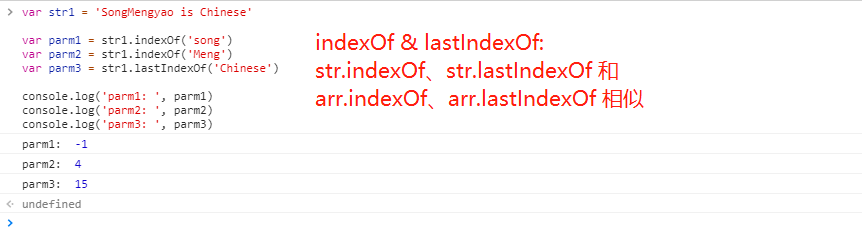
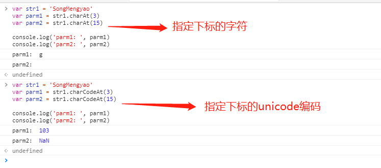
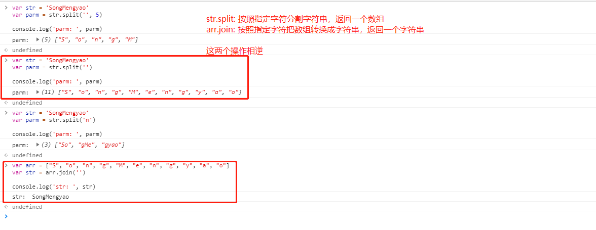
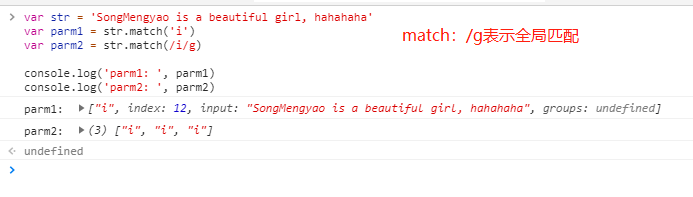
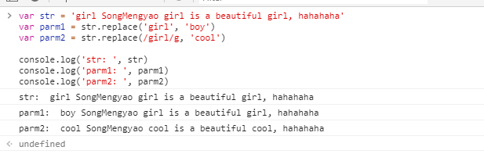
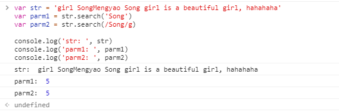

[返回目录](../原生JS.md)

**` 操作字符串的方法 `**

eg: `concat、indexOf、lastIndexOf、charAt、charCodeAt、substring、substr、match、replace、search、slice、split、length、toLowerCase、toUpperCase、trim 等`，随机列举几个：

  - (1). concat: 连接字符串，不改变原字符串，返回连接后的字符串。`和arr.concat(arr2, arr3)相似`。通过 '+' 运算符连接字符串会更简单。
  ```
  var str1 = 'SongMengyao'
  var str2 = 'China'
  var str3 = 'ShangHai'
  var str4 = str1.concat(str2, str3)

  console.log('str1: ', str1)
  console.log('str2: ', str2)
  console.log('str3: ', str3)
  console.log('str4: ', str4)
  ```
  结果如图：
  

  - (2). indexOf & lastIndexOf
    - indexOf: 查找字符串中某个字子串第一次出现的位置
    - lastIndexOf: 查找字符串中某个子串最后一次出现的位置
  ```
  var str1 = 'SongMengyao is Chinese'

  var parm1 = str1.indexOf('song')
  var parm2 = str1.indexOf('Meng')
  var parm3 = str1.lastIndexOf('Chinese')

  console.log('parm1: ', parm1)
  console.log('parm2: ', parm2)
  console.log('parm3: ', parm3)
  ```
  结果如图：
  

  - (3). charAt & charCodeAt
    - charAt: 找出字符串中指定下标的字符(一个字符)
    - charCodeAt: 找出字符串中指定下标的字符的 Unicode 编码
  ```
  var str1 = 'SongMengyao'
  var parm1 = str1.charAt(3)
  var parm2 = str1.charAt(15)

  console.log('parm1: ', parm1)
  console.log('parm2: ', parm2)

  -------------------------------------

  var str1 = 'SongMengyao'
  var parm1 = str1.charCodeAt(3)
  var parm2 = str1.charCodeAt(15)

  console.log('parm1: ', parm1)
  console.log('parm2: ', parm2)
  ```
  结果如图：
  

  - (4). split: 分割字符串，返回一个数组。不改变原始字符串。`arr.join()是把数组转成字符串，刚好相反操作`。
  ```
  var str = 'SongMengyao'
  var parm = str.split('', 5)

  console.log('parm: ', parm)

  --------------------------------

  var str = 'SongMengyao'
  var parm = str.split('')

  console.log('parm: ', parm)

  --------------------------------

  var str = 'SongMengyao'
  var parm = str.split('n')

  console.log('parm: ', parm)

  --------------------------------

  var arr = ["S", "o", "n", "g", "M", "e", "n", "g", "y", "a", "o"]
  var str = arr.join('')

  console.log('str: ', str)
  ```
  结果如图：
  

  - (5). match: 在字符串中匹配字符串，可用字符串匹配也可用正则匹配。匹配是加上/g代表全局匹配。
  ```
  var str = 'SongMengyao is a beautiful girl, hahahaha'
  var parm1 = str.match('i')
  var parm2 = str.match(/i/g)

  console.log('parm1: ', parm1)
  console.log('parm2: ', parm2)
  ```
  结果如图：
  

  - (6). replace: 替换字符串中一些字符，或替换掉和正则表达式匹配的字符串。不改变原字符串。
  ```
  var str = 'girl SongMengyao girl is a beautiful girl, hahahaha'
  var parm1 = str.replace('girl', 'boy')
  var parm2 = str.replace(/girl/g, 'cool')

  console.log('str: ', str)
  console.log('parm1: ', parm1)
  console.log('parm2: ', parm2)
  ```
  结果如图：
  

  - (7). search: 检索子字符串在字符串中的位置，或匹配正则表达式的子字符串在字符串中的位置。若不存在，返回-1。
  ```
  var str = 'girl SongMengyao Song girl is a beautiful girl, hahahaha'
  var parm1 = str.search('Song')
  var parm2 = str.search(/Song/g)

  console.log('str: ', str)
  console.log('parm1: ', parm1)
  console.log('parm2: ', parm2)
  ```
  结果如图：
  

[返回目录](../原生JS.md)
