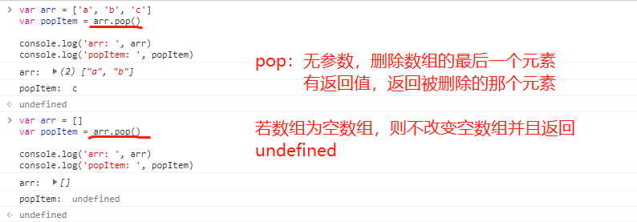
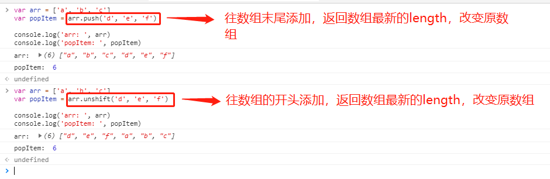
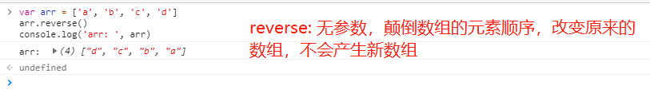
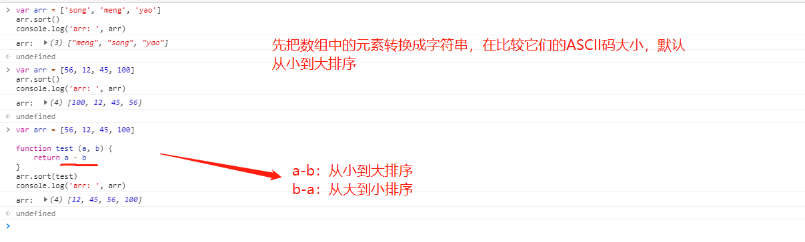
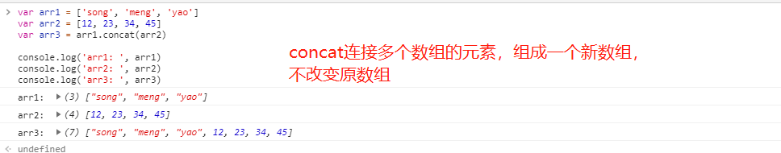
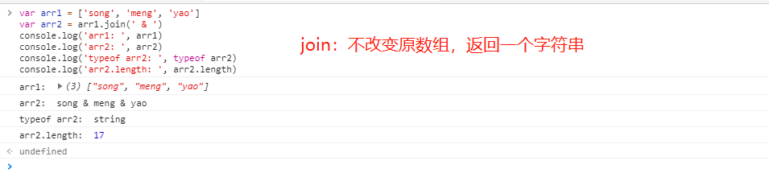
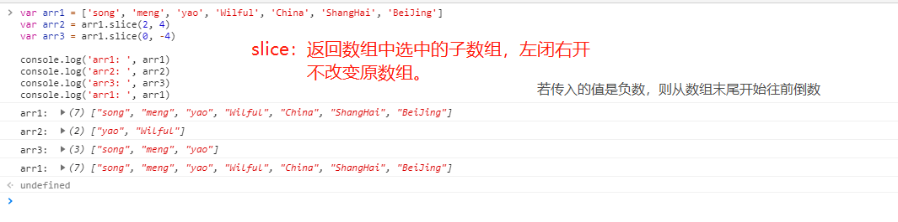
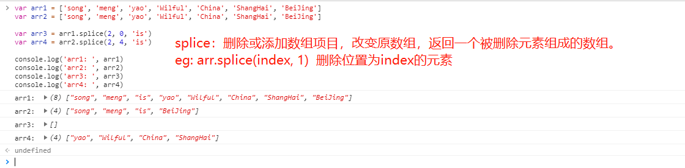
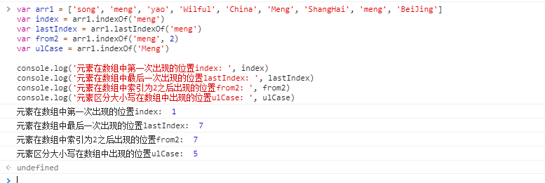

[返回目录](../原生JS.md)

操作数组的方法，`eg: push、pop、unshift、shift、reverse、sort、concat、join、slice、splice、indexOf、lastIndeOf、every、some、filter、map、forEach、for、reduce、reduceRight 等`，随机列举几个：

  - (1). pop & shift
    - pop: 删除数组的最后一项，比如 arr.pop()，无参数。有返回值，返回被删除的那个值。若数组为空数组，则不改变空数组并且返回undefined。

    - shift: 删除数组的第一项，比如 arr.shift()，无参数。有返回值，返回被删除的那个值。若数组为空数组，则不改变空数组并且返回undefined。
    ```
    var arr = ['a', 'b', 'c']
    var popItem = arr.pop()

    console.log('arr: ', arr)
    console.log('popItem: ', popItem)

    --------------------------------------

    var arr = []
    var popItem = arr.pop()

    console.log('arr: ', arr)
    console.log('popItem: ', popItem)

    --------------------------------------

    var arr = ['a', 'b', 'c']
    var popItem = arr.shift()

    console.log('arr: ', arr)
    console.log('popItem: ', popItem)
    ```
    结果如图：
    

  - (2). unshift & push
    - unshift: 在数组的开头添加一个或多个元素，改变原数组，有返回值，返回数组的最新的长度。
    - push: 在数组的末尾添加一个或多个元素，改变原数组，有返回值，返回数组的最新的长度。
    ```
    var arr = ['a', 'b', 'c']
    var popItem = arr.unshift('d', 'e', 'f')

    console.log('arr: ', arr)
    console.log('popItem: ', popItem)

    -----------------------------------------------

    var arr = ['a', 'b', 'c']
    var popItem = arr.push('d', 'e', 'f')

    console.log('arr: ', arr)
    console.log('popItem: ', popItem)
    ```
    结果如图：
    

  - (3). reverse: 颠倒数组中元素的顺序，改变原来的数组，例如 arr.reverse()。无参数
    ```
    var arr = ['a', 'b', 'c', 'd']
    arr.reverse()
    console.log('arr: ', arr)
    ```
    结果如图：
    

  - (4). sort: 将数组中的元素进行排序，原理是先把元素转换成字符串，然后根据ASCII码进行从小到大排序。`默认是从小到大排序。`sort也是一个高阶函数，可以传入一个function做参数，对数组进行特殊处理。function的返回值可以做如下处理：
    ```
    function compare(a, b) {
      if (a > b) {
        return 1 // 返回一个大于0的值即可, 排序后是 b, a
      }
      if (a == b) {
        return 0 // 相等就返回0,  排序后是 b, a 或 a, b
      }
      if (a < b) {
        return -1 // 返回小于0的值,  排序后是 a, b
      }
    }
    ```

    ```
    var arr = ['song', 'meng', 'yao']
    arr.sort()
    console.log('arr: ', arr)

    -----------------------------------------

    var arr = [56, 12, 45, 100]
    arr.sort()
    console.log('arr: ', arr)

    -----------------------------------------

    var arr = [56, 12, 45, 100]

    function test (a, b) {
      return a - b
    }
    arr.sort(test)
    console.log('arr: ', arr)
    ```
    结果如图：
    

  - (5). concat: 连接多个数组成一个新数组，不改变原来的数组。
    ```
    var arr1 = ['song', 'meng', 'yao']
    var arr2 = [12, 23, 34, 45]
    var arr3 = arr1.concat(arr2)

    console.log('arr1: ', arr1)
    console.log('arr2: ', arr2)
    console.log('arr3: ', arr3)
    ```
    结果如图：
    

  - (6). join: 不改变原数组，有返回值。把一个数组的所有元素按照指定的字符连接起来，以一个字符串的形势返回。
    ```
    var arr1 = ['song', 'meng', 'yao']
    var arr2 = arr1.join(' & ')
    console.log('arr1: ', arr1)
    console.log('arr2: ', arr2)
    console.log('typeof arr2: ', typeof arr2)
    console.log('arr2.length: ', arr2.length)
    ```
    结果如图：
    

  - (7). slice: 选取数组中的某一段，采用左闭右开方式。不改变原数组，返回一个子数组。
  ```
  var arr1 = ['song', 'meng', 'yao', 'Wilful', 'China', 'ShangHai', 'BeiJing']
  var arr2 = arr1.slice(2, 4)
  var arr3 = arr1.slice(0, -4)

  console.log('arr1: ', arr1)
  console.log('arr2: ', arr2)
  console.log('arr3: ', arr3)
  console.log('arr1: ', arr1)
  ```
  结果如图：
  

  - (8). splice: 删除/添加数组项目，改变原数组，返回一个被删除的元素组成的数组。
  ```
  var arr1 = ['song', 'meng', 'yao', 'Wilful', 'China', 'ShangHai', 'BeiJing']
  var arr2 = ['song', 'meng', 'yao', 'Wilful', 'China', 'ShangHai', 'BeiJing']

  var arr3 = arr1.splice(2, 0, 'is')
  var arr4 = arr2.splice(2, 4, 'is')

  console.log('arr1: ', arr1)
  console.log('arr2: ', arr2)
  console.log('arr3: ', arr3)
  console.log('arr4: ', arr4)
  ```
  结果如图：
  

  - (9). indexOf & lastIndexOf
    - indexOf: 元素在数组中第一次出现的位置
    - lastIndexOf: 元素在数组中最后一次出现的位置
  ```
  var arr1 = ['song', 'meng', 'yao', 'Wilful', 'China', 'Meng', 'ShangHai', 'meng', 'BeiJing']
  var index = arr1.indexOf('meng')
  var lastIndex = arr1.lastIndexOf('meng')
  var from2 = arr1.indexOf('meng', 2)
  var ulCase = arr1.indexOf('Meng')

  console.log('元素在数组中第一次出现的位置index: ', index)
  console.log('元素在数组中最后一次出现的位置lastIndex: ', lastIndex)
  console.log('元素在数组中索引为2之后出现的位置from2: ', from2)
  console.log('元素区分大小写在数组中出现的位置ulCase: ', ulCase)
  ```
  结果如图：
  


[返回目录](../原生JS.md)
