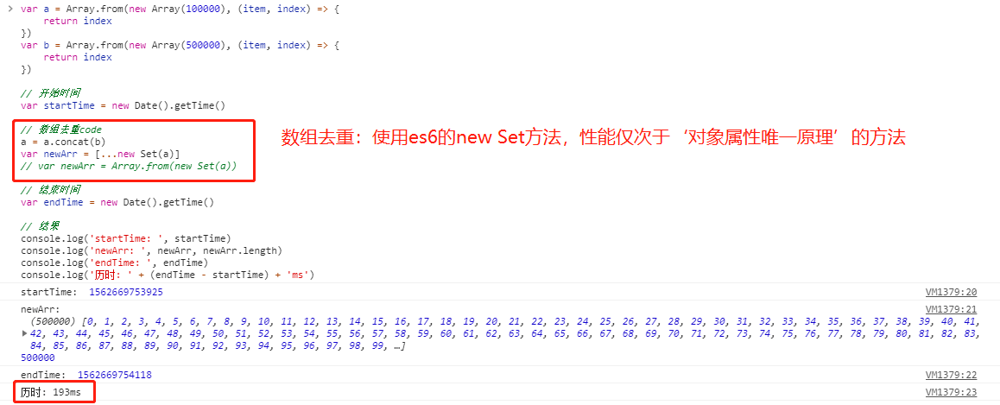

[返回目录](../原生JS.md)

**` 数组去重(共 6 种方法，性能：逐个递减) `**

  用下面代码创建两个数组：

    ```
      var a = Array.from(new Array(100000), (item, index) => {
        return index
      })
      var b = Array.from(new Array(500000), (item, index) => {
        return index
      })
    ```

  其中a数组的长度为a.length = 100000，b数组的长度为b.length = 500000。用下面代码计算数组去重所用时间：
  
    ```
      var startTime = new Date().getTime()
      // 数组去重code
      var endTime = new Date().getTime()

      var timeDiff = endTime - startTime
      console.log('历时: ' + timeDiff + 'ms')
    ```

  用下面方法进行数组去重：

  - (1). 利用对象的属性不会重复这一特性，校验数组元素是否重复：

      ```
        var a = Array.from(new Array(100000), (item, index) => {
          return index
        })
        var b = Array.from(new Array(500000), (item, index) => {
          return index
        })
        // 开始时间
        var startTime = new Date().getTime()

        // 数组去重code
        a = a.concat(b)
        var result = []
        var obj = {}

        for (var i of a) {
          if (!obj[i]) {
              result.push(i)
                obj[i] = 1
            }
        }

        // 结束时间
        var endTime = new Date().getTime()

        // 结果
        console.log('startTime: ', startTime)
        console.log('result: ', result, result.length)
        console.log('result.length: ', result.length)
        console.log('endTime: ', endTime)
        console.log('历时: ' + (endTime - startTime) + 'ms')
      ```
      结果如下图：
      

  - (2). 使用 sort() 将数组进行排序，然后比较相邻元素是否相等去重：(原因：只做了一次排序和一次循环)
      ```
        var a = Array.from(new Array(100000), (item, index) => {
          return index
        })
        var b = Array.from(new Array(500000), (item, index) => {
          return index
        })

        // 开始时间
        var startTime = new Date().getTime()

        // 数组去重code
        a = a.concat(b)
        a = a.sort()
        var result = [a[0]]

        for (var i=1, len=a.length; i<len; i++) {
          a[i] !== a[i-1] && result.push(a[i])
        }

        // 结束时间
        var endTime = new Date().getTime()

        // 结果
        console.log('startTime: ', startTime)
        console.log('result: ', result, result.length)
        console.log('endTime: ', endTime)
        console.log('历时: ' + (endTime - startTime) + 'ms')
      ```
      结果如下图：
      


  - (3). es6的new Set方法去重：
      ```
        var a = Array.from(new Array(100000), (item, index) => {
          return index
        })
        var b = Array.from(new Array(500000), (item, index) => {
          return index
        })

        // 开始时间
        var startTime = new Date().getTime()

        // 数组去重code
        a = a.concat(b)
        var newArr = [...new Set(a)]
        // var newArr = Array.from(new Set(a))

        // 结束时间
        var endTime = new Date().getTime()

        // 结果
        console.log('startTime: ', startTime)
        console.log('newArr: ', newArr, newArr.length)
        console.log('endTime: ', endTime)
        console.log('历时: ' + (endTime - startTime) + 'ms')
      ```
      结果如下图：
      

  - (4). 双重循环去重(循环层越多，性能越差; 如果把a和b的长度换一下，历时会更长，大概200000ms)：
      ```
        var a = Array.from(new Array(100000), (item, index) => {
          return index
        })
        var b = Array.from(new Array(500000), (item, index) => {
          return index
        })

        // 开始时间
        var startTime = new Date().getTime()

        // 数组去重code
        a.forEach((aItem, aIndex) => {
          var c = b.every((bItem, bIndex) => {
              return aItem !== bItem
            })
            if(c) {
                b.push(aItem)
            }
        })

        // 结束时间
        var endTime = new Date().getTime()

        // 结果
        console.log('startTime: ', startTime)
        console.log('b: ', b, b.length)
        console.log('endTime: ', endTime)
        console.log('历时: ' + (endTime - startTime) + 'ms')
      ```
      结果如下图：
      

  - (5). filter + indexOf去重 (和for...of... + includes性能差不多，因为原理类似)：
      ```
        var a = Array.from(new Array(100000), (item, index) => {
          return index
        })
        var b = Array.from(new Array(500000), (item, index) => {
            return index
        })

        // 开始时间
        var startTime = new Date().getTime()

        // 数组去重code
        a = a.concat(b)
        var newArr = a.filter((item, index)=> {
          return a.indexOf(item) === index
        })

        // 结束时间
        var endTime = new Date().getTime()

        // 结果
        console.log('startTime: ', startTime)
        console.log('newArr: ', newArr, newArr.length)
        console.log('endTime: ', endTime)
        console.log('历时: ' + (endTime - startTime) + 'ms')
      ```
      结果如下图：
      

  - (6). for...of... + includes去重 (和filter + indexOf性能差不多，因为原理类似)：
      ```
        var a = Array.from(new Array(100000), (item, index) => {
          return index
        })
        var b = Array.from(new Array(500000), (item, index) => {
            return index
        })

        // 开始时间
        var startTime = new Date().getTime()

        // 数组去重code
        a = a.concat(b)
        var newArr = []
        for (let i of a) {
          !newArr.includes(i) && newArr.push(i)
        }

        // 结束时间
        var endTime = new Date().getTime()

        // 结果
        console.log('startTime: ', startTime)
        console.log('newArr: ', newArr, newArr.length)
        console.log('endTime: ', endTime)
        console.log('历时: ' + (endTime - startTime) + 'ms')
      ```
      结果如下图：
      

[返回目录](../原生JS.md)
