[返回目录](../原生JS.md)

**` 数组遍历 `**
    
  数组的遍历大概有`for、for...in、for...of、forEach、every、map、some、filter、reduce、reduceRight、find、findIndex` 12种，分别如下：
  - (1). for循环：(性能挺好)
    ```
    var start = new Date().getTime()
    var a = 0

    for (var i = 0, j = 1000000; i < j; i++) {
      a++
    }

    var end = new Date().getTime()

    console.log('a: ', a)
    console.log('历时: ', end - start + 'ms')
    ```
    结果如图：
    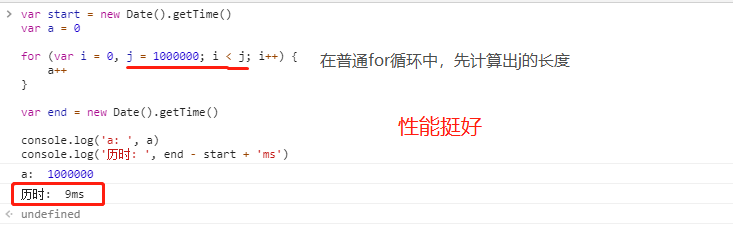

  - (2). for...in循环：(考虑到原型的问题，不推荐使用)
    ```
    var arr = Array.from(new Array(1000000), (item, index) => {
      return index
    })
    var start = new Date().getTime()
    var a = 0

    for (item in arr) {
      a++
    }

    var end = new Date().getTime()

    console.log('a: ', a)
    console.log('历时: ', end - start + 'ms')
    ```
    结果如图：
    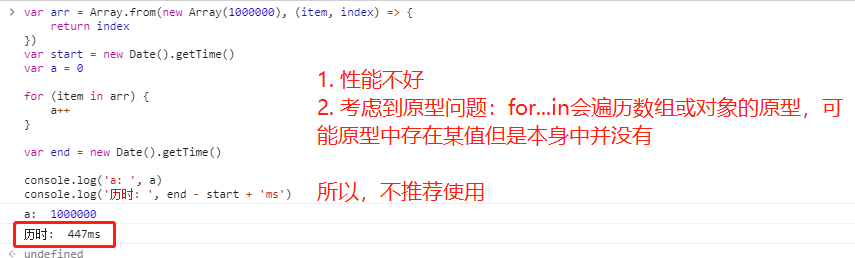

  - (3). for...of循环：
    ```
    var arr = Array.from(new Array(1000000), (item, index) => {
      return index
    })
    var start = new Date().getTime()
    var a = 0

    for (item of arr) {
      a++
    }

    var end = new Date().getTime()

    console.log('a: ', a)
    console.log('历时: ', end - start + 'ms')
    ```
    结果如图：
    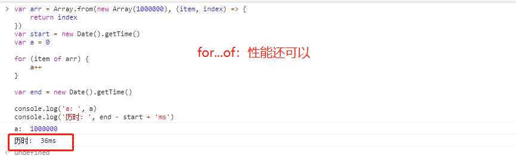

  - (4). forEach循环：(`无返回值，即return不生效`)
    ```
    var arr = Array.from(new Array(1000000), (item, index) => {
      return index
    })
    var start = new Date().getTime()
    var a = 0

    arr.forEach((item, index) => {
      a++
    })

    var end = new Date().getTime()

    console.log('a: ', a)
    console.log('历时: ', end - start + 'ms')
    ```
    结果如图：
    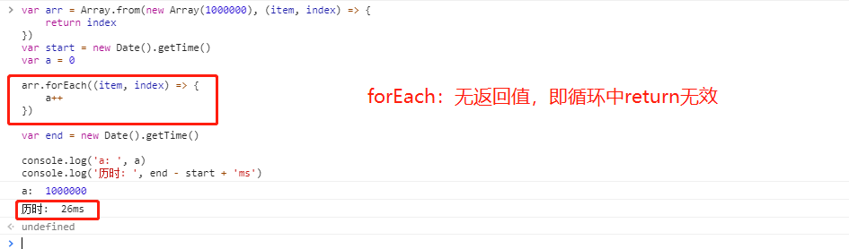

  - (5). every循环：检测数组中的所有元素，是否都符合条件，若一个返回false，则跳出循环，剩下的元素不再循环。every不改变原数组。
    ```
    var arr = Array.from(new Array(1000000), (item, index) => {
      return index
    })

    arr.every((item, index) => {
      if(item > 10) {
        return false
      }else {
        return true
      }
    })
    ```
    结果如图：
    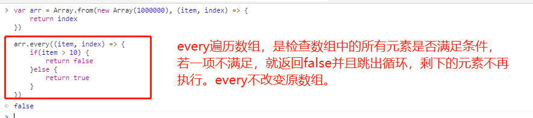

  - (6). map循环：`有返回值，返回一个新数组，不改变原数组`。这个新数组是原数组的每个值经过特定的条件处理之后的值组成的新数组。
    ```
    var arr = Array.from(new Array(10), (item, index) => {
      return index
    })

    var newArr = arr.map((item, index) => {
      return item * 2
    })

    console.log('arr: ', arr)
    console.log('newArr: ', newArr)
    ```
    结果如图：
    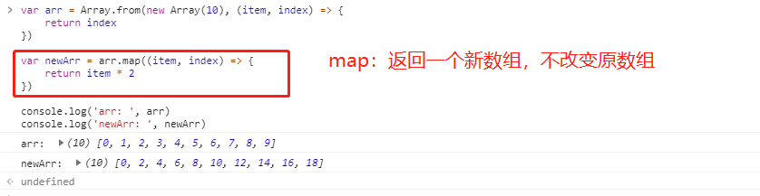

  - (7). some循环：遍历数组中的所有元素，只要有一个满足条件，就返回true并且跳出循环，剩下的元素不再遍历。some循环不改变原数组。
    ```
    var arr = Array.from(new Array(100), (item, index) => {
      return index
    })

    arr.some((item, index) => {
      if(item > 10) {
        return true
      }
    })
    ```
    结果如图：
    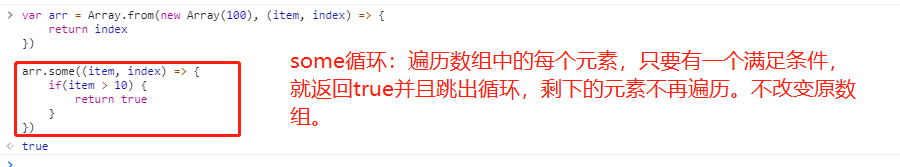

  - (8). filter循环：遍历数组中的每一项，筛选出符合条件的元素，然后组成一个新数组返回，不改变原数组。
    ```
    var arr = Array.from(new Array(10), (item, index) => {
      return index
    })

    var newArr = arr.filter((item, index) => {
      if(item > 5) {
        return true
      }
    })

    console.log('arr: ', arr)
    console.log('newArr: ', newArr)
    ```
    结果如图：
    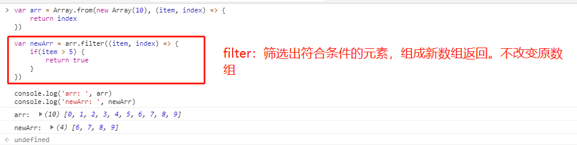

  - (9). reduce循环：接收一个函数作为累加器，把数组的值从左到右依次进行计算，最后合并成一个值。
    ```
    var arr = Array.from(new Array(5), (item, index) => {
      return index
    })

    var newArr = arr.reduce((total, num) => {
      return total + num
    })

    console.log('arr: ', arr)
    console.log('newArr: ', newArr)
    ```
    结果如图：
    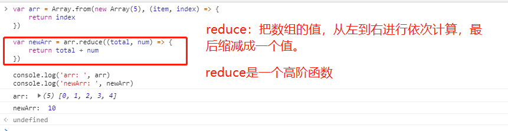

  - (10). reduceRight：接收一个函数作为累加器，把数组的值从右到左依次进行计算，最后合并成一个值。`和reduce功能一样，只不过reduceRight是从右至左计算。`
    ```
    var arr = Array.from(new Array(5), (item, index) => {
      return index
    })

    var newArr = arr.reduceRight((total, num) => {
      return total + num
    })

    console.log('arr: ', arr)
    console.log('newArr: ', newArr)
    ```
    结果如图：
    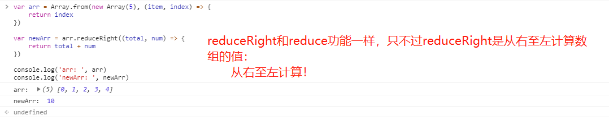

  - (11). find：遍历数组，返回数组中第一个符合条件的值，剩下的值就不再遍历。如果数组的所有值都不符合要求，则返回undefined。find不改变原数组。
    ```
    var arr = Array.from(new Array(5), (item, index) => {
      return index
    })

    var newArr = arr.find((item, index) => {
      return item > 2
    })

    console.log('arr: ', arr)
    console.log('newArr: ', newArr)
    ```
    结果如图：
    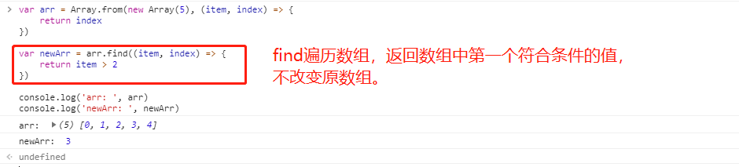

  - (12). findIndex：遍历数组，返回数组中第一个符合条件的值所在的位置(索引)，剩下的值不再遍历。如果数组中没有符合条件的值，就返回-1。findIndex不改变原数组。
    ```
    var arr = Array.from(new Array(5), (item, index) => {
      return index
    })

    var newArr = arr.findIndex((item, index) => {
      return item > 2
    })

    console.log('arr: ', arr)
    console.log('newArr: ', newArr)
    ```
    结果如图：
    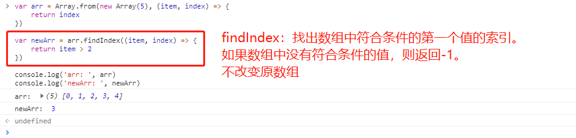

[返回目录](../原生JS.md)
