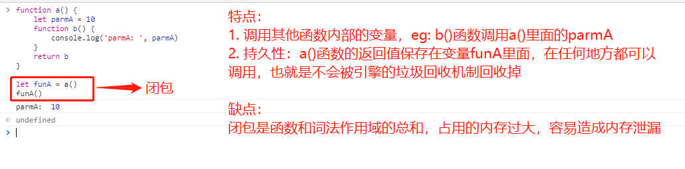

[返回目录](../原生JS.md)

**` 闭包 `**

  - (1). js为什么有闭包？

    闭包并不是一个需要学习新的语法或模式才能使用的工具，闭包是基于`词法作用域书写代码时所产生的自然结果`，你甚至不需要为了利用它们而有意识地创建闭包。闭包的创建和使用在你的代码中随处可见。你缺少的是根据你自己的意愿来识别、拥抱和影响闭包的思维环境。

  - (2). js的闭包是什么？

    当函数记住并且可以访问所在的词法作用域时，就产生了闭包。`如果将函数(访问自己的词法作用域)当做第一级的值类型并且到处传递，这就是闭包。`
        
  - (3). js闭包的作用？

    - 闭包是连接函数内部和外部的桥梁
    - 闭包可以阻止垃圾的回收机制

  - (4). 闭包的列子

    - 词法作用域规则(只是闭包的一部分)
      ```
      function foo() {
        var a = 2;
        function bar() {
          console.log( a );  // 2
        }
        bar();
      }
      foo();
      ```
    - 闭包列子：
      ```
      列1、
        function foo() {
          var a = 2
          function bar() { 
            console.log( a )
          }
          return bar
        }
        var baz = foo()
        baz()  // 2
      ```
      ```
      列2、
        function foo() {
          var a = 2;
          function baz() {
            console.log( a ); // 2
          }
          bar( baz );
        }
        function bar(fn) {
          fn(); // 闭包
        }
      ```
      ```
      列3、
        var fn;
        function foo() {
          var a = 2;
          function baz() {
            console.log( a );
          }
          fn = baz; // 将 baz 分配给全局变量
        }
        function bar() {
          fn(); // 闭包
        }
        foo();
        bar(); // 2
      ```
      ```
      列4、
        function wait(message) {
          setTimeout( function timer() {
            console.log( message );
          }, 1000 );
        }
        wait( "Hello, World!" );
      ```
      列5、
      

[返回目录](../原生JS.md)
