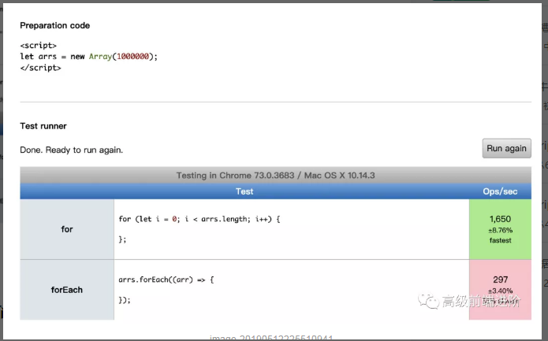
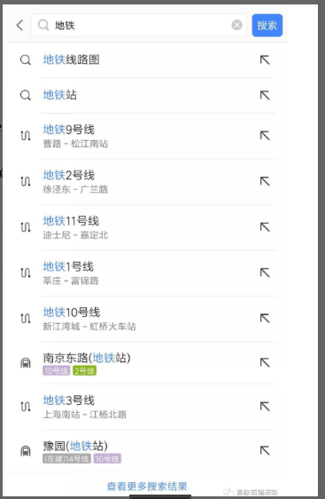
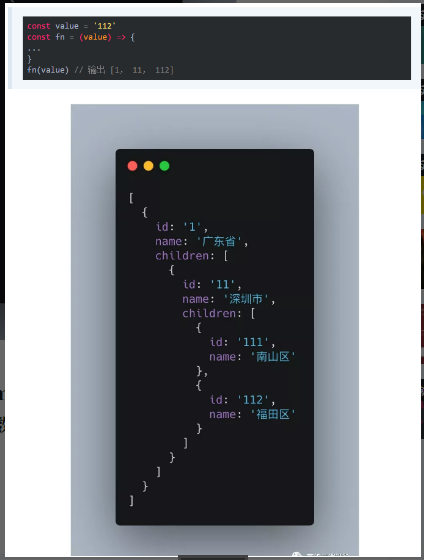

1. 写 React / Vue 项目时为什么要在列表组件中写 key，其作用是什么？
2. `['1', '2', '3'].map(parseInt)` what & why ?
3. 什么是防抖和节流？有什么区别？如何实现？
4. 介绍下 Set、Map、WeakSet 和 WeakMap 的区别？
5. 介绍下深度优先遍历和广度优先遍历，如何实现？
6. 请分别用深度优先思想和广度优先思想实现一个拷贝函数？
7. ES5/ES6 的继承除了写法以外还有什么区别？
8. setTimeout、Promise、Async/Await 的区别
9. Async/Await 如何通过同步的方式实现异步
10. 请写出下面代码的运行结果(异步):
  ```
    async function async1() {
      console.log('async1 start');
      await async2();
      console.log('async1 end');
    }
    async function async2() {
      console.log('async2');
    }
    console.log('script start');
    setTimeout(function() {
      console.log('setTimeout');
    }, 0)
    async1();
    new Promise(function(resolve) {
      console.log('promise1');
      resolve();
    }).then(function() {
      console.log('promise2');
    });
    console.log('script end');
  ```
11. 已知如下数组：(算法手写题)
  ```
    var arr = [ [1, 2, 2], [3, 4, 5, 5], [6, 7, 8, 9, [11, 12, [12, 13, [14] ] ] ], 10];
  ```
编写一个程序将数组扁平化并去除其中重复部分数据，最终得到一个升序且不重复的数组

12. JS 异步解决方案的发展历程以及优缺点。
13. Promise 构造函数是同步执行还是异步执行，那么 then 方法呢？
14. 如何实现一个 new ？
15. 简单讲解一下http2的多路复用
16. 谈谈你对TCP三次握手和四次挥手的理解
17. A、B 机器正常连接后，B 机器突然重启，问 A 此时处于 TCP 什么状态？

(如果A 与 B 建立了正常连接后，从未相互发过数据，这个时候 B 突然机器重启，问 A 此时处于 TCP 什么状态？如何消除服务器程序中的这个状态？（超纲题，了解即可）)

18. React 中 setState 什么时候是同步的，什么时候是异步的？
19. 下面的代码输出什么？(React setState 笔试题)
```
  class Example extends React.Component {
    constructor() {
      super();
      this.state = {
        val: 0
      };
    }

    componentDidMount() {
      this.setState({val: this.state.val + 1});
      console.log(this.state.val);    // 第 1 次 log

      this.setState({val: this.state.val + 1});
      console.log(this.state.val);    // 第 2 次 log

      setTimeout(() => {
        this.setState({val: this.state.val + 1});
        console.log(this.state.val);  // 第 3 次 log

        this.setState({val: this.state.val + 1});
        console.log(this.state.val);  // 第 4 次 log
      }, 0);
    }

    render() {
      return null;
    }
  };
```
20. 介绍下 npm 模块安装机制，为什么输入 npm install 就可以自动安装对应的模块？
21. 有以下 3 个判断数组的方法，请分别介绍它们之间的区别和优劣
```
  Object.prototype.toString.call() 、 instanceof 以及 Array.isArray()
```
22. 介绍下重绘和回流（Repaint & Reflow），以及如何进行优化
23. 介绍下观察者模式和订阅-发布模式的区别，各自适用于什么场景
24. 聊聊 Redux 和 Vuex 的设计思想
25. 说说浏览器和 Node 事件循环的区别
26. 介绍模块化发展历程
```
  (提示：可从IIFE、AMD、CMD、CommonJS、UMD、webpack(require.ensure)、ES Module、<script type='module'> 这几个角度考虑。)
```
27. 全局作用域中，用 const 和 let 声明的变量不在 window 上，那到底在哪里？如何去获取？
28. cookie 和 token 都存放在 header 中，为什么不会劫持 token？
29. 聊聊 Vue 的双向数据绑定，Model 如何改变 View，View 又是如何改变 Model 的
30. 两个数组合并成一个数组:
```
  请把两个数组 ['A1', 'A2', 'B1', 'B2', 'C1', 'C2', 'D1', 'D2'] 和 ['A', 'B', 'C', 'D']，
  合并为 ['A1', 'A2', 'A', 'B1', 'B2', 'B', 'C1', 'C2', 'C', 'D1', 'D2', 'D']。
```
31. 改造下面的代码，使之输出0 - 9，写出你能想到的所有解法。
```
  for (var i = 0; i< 10; i++){
    setTimeout(() => {
      console.log(i);
    }, 1000)
  }
```
32. Virtual DOM 真的比操作原生 DOM 快吗？谈谈你的想法。
33. 下面的代码打印什么内容，为什么？
```
  var b = 10;
  (function b(){
      b = 20;
      console.log(b); 
  })();
```
34. 简单改造下面的代码，使之分别打印 10 和 20
```
  var b = 10;
  (function b(){
    b = 20;
    console.log(b); 
  })();
```
35. 浏览器缓存读取规则: 可以分成 Service Worker、Memory Cache、Disk Cache 和 Push Cache，那请求的时候 from memory cache 和 from disk cache 的依据是什么，哪些数据什么时候存放在 Memory Cache 和 Disk Cache中？
36. 使用迭代的方式实现 flatten 函数。
37. 为什么 Vuex 的 mutation 和 Redux 的 reducer 中不能做异步操作？
38. 下面代码中 a 在什么情况下会打印 1？
```
  var a = ?;
  if(a == 1 && a == 2 && a == 3){
    console.log(1);
  }
```
39. 介绍下 BFC 及其应用。(块格式化上下文 Block Formatting Context)
40. 在 Vue 中，子组件为何不可以修改父组件传递的 Prop。如果修改了，Vue 是如何监控到属性的修改并给出警告的。
41. 下面代码输出什么:
```
  var a = 10;
  (function () {
      console.log(a)
      a = 5
      console.log(window.a)
      var a = 20;
      console.log(a)
  })()
```
42. 实现一个 sleep 函数。比如 sleep(1000) 意味着等待1000毫秒，可从 Promise、Generator、Async/Await 等角度实现
43. 使用 sort() 对数组 [3, 15, 8, 29, 102, 22] 进行排序，输出结果
44. 介绍 HTTPS 握手过程
45. HTTPS 握手过程中，客户端如何验证证书的合法性
46. 输出以下代码执行的结果并解释为什么？
```
  var obj = {
    '2': 3,
    '3': 4,
    'length': 2,
    'splice': Array.prototype.splice,
    'push': Array.prototype.push
  }
  obj.push(1)
  obj.push(2)
  console.log(obj)
```
47. 双向绑定和 vuex 是否冲突
48. call 和 apply 的区别是什么，哪个性能更好一些？
49. 为什么通常在发送数据埋点请求的时候使用的是 1x1 像素的透明 gif 图片？
50. 实现 (5).add(3).minus(2) 功能。例：5 + 3 - 2，结果为 6
51. Vue 的响应式原理中 Object.defineProperty 有什么缺陷？为什么在 Vue3.0 采用了 Proxy，抛弃了 Object.defineProperty？
52. 怎么让一个 div 水平垂直居中
53. 输出以下代码的执行结果并解释为什么？
```
  var a = {n: 1};
  var b = a;
  a.x = a = {n: 2};

  console.log(a.x)     
  console.log(b.x)
```
54. 冒泡排序如何实现，时间复杂度是多少， 还可以如何改进？
55. 某公司 1 到 12 月份的销售额存在一个对象里面，如下：{1:222, 2:123, 5:888}，请把数据处理为如下结构：[222, 123, null, null, 888, null, null, null, null, null, null, null]。
56. 要求设计 LazyMan 类，实现以下功能。
```
  LazyMan('Tony');
  // Hi I am Tony

  LazyMan('Tony').sleep(10).eat('lunch');
  // Hi I am Tony
  // 等待了10秒...
  // I am eating lunch

  LazyMan('Tony').eat('lunch').sleep(10).eat('dinner');
  // Hi I am Tony
  // I am eating lunch
  // 等待了10秒...
  // I am eating diner

  LazyMan('Tony').eat('lunch').eat('dinner').sleepFirst(5).sleep(10).eat('junk food');
  // Hi I am Tony
  // 等待了5秒...
  // I am eating lunch
  // I am eating dinner
  // 等待了10秒...
  // I am eating junk food
```
57. 分析比较 opacity: 0、visibility: hidden、display: none 优劣和适用场景。
58. 箭头函数与普通函数（function）的区别是什么？构造函数（function）可以使用 new 生成实例，那么箭头函数可以吗？为什么？
59. 给定两个数组，写一个方法来计算它们的交集。例如：给定 nums1 = [1, 2, 2, 1]，nums2 = [2, 2]，返回 [2, 2]。
60. 已知如下代码，如何修改才能让图片宽度为 300px ？注意下面代码不可修改。
```
  
```
61. 介绍下如何实现 token 加密
62. redux 为什么要把 reducer 设计成纯函数？
63. 如何设计实现无缝轮播？
64. 模拟实现一个 Promise.finally
65. `a.b.c.d` 和 `a['b']['c']['d']`，哪个性能更高？
66. ES6 代码转成 ES5 代码的实现思路是什么
67. 数组编程题：随机生成一个长度为 10 的整数类型的数组，例如 [2, 10, 3, 4, 5, 11, 10, 11, 20]，将其排列成一个新数组，要求新数组形式如下，例如 [[2, 3, 4, 5], [10, 11], [20]]。
68. 如何解决移动端 Retina 屏 1px 像素问题
69. 如何把一个字符串的大小写取反（大写变小写小写变大写），例如 ’AbC' 变成 'aBc' 。
70. 介绍下 webpack 热更新原理，是如何做到在不刷新浏览器的前提下更新页面的
71. 实现一个字符串匹配算法，从长度为 n 的字符串 S 中，查找是否存在字符串 T，T 的长度是 m，若存在返回所在位置。
72. 为什么普通 `for` 循环的性能远远高于 `forEach` 的性能，请解释其中的原因。
  
73. 介绍下 BFC、IFC、GFC 和 FFC
74. 使用 JavaScript Proxy 实现简单的数据绑定
75. 数组里面有10万个数据，取第一个元素和第10万个元素的时间相差多少
76. 输出以下代码运行结果:
```
  // example 1
  var a={}, b='123', c=123;  
  a[b]='b';
  a[c]='c';  
  console.log(a[b]);

  ---------------------
  // example 2
  var a={}, b=Symbol('123'), c=Symbol('123');  
  a[b]='b';
  a[c]='c';  
  console.log(a[b]);

  ---------------------
  // example 3
  var a={}, b={key:'123'}, c={key:'456'};  
  a[b]='b';
  a[c]='c';  
  console.log(a[b]);
```
77. 算法题「旋转数组」: 给定一个数组，将数组中的元素向右移动 k 个位置，其中 k 是非负数。
```
  eg1:
    输入: [1, 2, 3, 4, 5, 6, 7] 和 k = 3
    输出: [5, 6, 7, 1, 2, 3, 4]
    解释:
    向右旋转 1 步: [7, 1, 2, 3, 4, 5, 6]
    向右旋转 2 步: [6, 7, 1, 2, 3, 4, 5]
    向右旋转 3 步: [5, 6, 7, 1, 2, 3, 4]

  eg2:
    输入: [-1, -100, 3, 99] 和 k = 2
    输出: [3, 99, -1, -100]
    解释: 
    向右旋转 1 步: [99, -1, -100, 3]
    向右旋转 2 步: [3, 99, -1, -100]
```
78. Vue 的父组件和子组件生命周期钩子执行顺序是什么？
79. input 搜索如何防抖，如何处理中文输入？
80. 介绍下 Promise.all 使用、原理实现及错误处理
81. 打印出 1 - 10000 之间的所有对称数。例如：121、1331 等
82. 算法题之「移动零」：给定一个数组 nums，编写一个函数将所有 0 移动到数组的末尾，同时保持非零元素的相对顺序。
```
  输入: [0,1,0,3,12]
  输出: [1,3,12,0,0]

  说明:
    必须在原数组上操作，不能拷贝额外的数组。
    尽量减少操作次数。
```
83. var、let 和 const 区别的实现原理是什么？
84. 请实现一个 add 函数，满足以下功能。
```
  add(1);       // 1
  add(1)(2);    // 3
  add(1)(2)(3); // 6
  add(1)(2, 3); // 6
  add(1, 2)(3); // 6
  add(1, 2, 3); // 6
```
85. `react-router 里的 <Link> 标签和 <a> 标签有什么区别？如何禁掉 <a> 标签默认事件，禁掉之后如何实现跳转。`
86. 算法题之「两数之和」：给定一个整数数组和一个目标值，找出数组中和为目标值的两个数。你可以假设每个输入只对应一种答案，且同样的元素不能被重复利用。
```
  eg: 给定 nums = [2, 7, 11, 15], target = 9

      因为 nums[0] + nums[1] = 2 + 7 = 9
      所以返回 [0, 1]
```
87. 在输入框中如何判断输入的是一个正确的网址。
88. 实现 convert 方法，把原始 list 转换成树形结构，要求尽可能降低时间复杂度。
```
  以下数据结构中，id 代表部门编号，name 是部门名称，parentId 是父部门编号，为 0 代表一级部门，现在要求实现一个 convert 方法，把原始 list 转换成树形结构，parentId 为多少就挂载在该 id 的属性 children 数组下，结构如下：

  // 原始 list 如下
  let list =[
    {id:1,name:'部门A',parentId:0},
    {id:2,name:'部门B',parentId:0},
    {id:3,name:'部门C',parentId:1},
    {id:4,name:'部门D',parentId:1},
    {id:5,name:'部门E',parentId:2},
    {id:6,name:'部门F',parentId:3},
    {id:7,name:'部门G',parentId:2},
    {id:8,name:'部门H',parentId:4}
  ];
  const result = convert(list, ...);

  // 转换后的结果如下
  let result = [
    {
      id: 1,
      name: '部门A',
      parentId: 0,
      children: [
        {
          id: 3,
          name: '部门C',
          parentId: 1,
          children: [
            {
              id: 6,
              name: '部门F',
              parentId: 3
            }, {
              id: 16,
              name: '部门L',
              parentId: 3
            }
          ]
        },
        {
          id: 4,
          name: '部门D',
          parentId: 1,
          children: [
            {
              id: 8,
              name: '部门H',
              parentId: 4
            }
          ]
        }
      ]
    },
    ···
  ];
```
89. 设计并实现 Promise.race()
90. 实现模糊搜索结果的关键词高亮显示
  
91. 介绍下 HTTPS 中间人攻击
92. 已知数据格式，实现一个函数 fn 找出链条中所有的父级 id
```
  const value = '112'
  const fn = (value) => {
  ...
  }
  fn(value) // 输出 [1， 11， 112]
```
  
93. 给定两个大小为 m 和 n 的有序数组 nums1 和 nums2。请找出这两个有序数组的中位数。要求算法的时间复杂度为 O(log(m+n))。
```
  eg1:
  nums1 = [1, 3]
  nums2 = [2]
  // 中位数是 2.0

  eg2:
  nums1 = [1, 2]
  nums2 = [3, 4]
  // 中位数是(2 + 3) / 2 = 2.5
```
94. vue 在 v-for 时给每项元素绑定事件需要用事件代理吗？为什么？
95. 模拟实现一个深拷贝，并考虑对象相互引用以及 Symbol 拷贝的情况
96. 介绍下前端加密的常见场景和方法
97. React 和 Vue 的 diff 时间复杂度从 O(n^3) 优化到 O(n) ，那么 O(n^3) 和 O(n) 是如何计算出来的？
98. 写出如下代码的打印结果:
```
  function changeObjProperty(o) {
    o.siteUrl = "http://www.baidu.com"
    o = new Object()
    o.siteUrl = "http://www.google.com"
  } 
  let webSite = new Object();
  changeObjProperty(webSite);
  console.log(webSite.siteUrl);
```
99. 编程算法题：用 JavaScript 写一个函数，输入 int 型，返回整数逆序后的字符串。如：输入整型 1234，返回字符串“4321”。要求必须使用递归函数调用，不能用全局变量，输入函数必须只有一个参数传入，必须返回字符串。
100. 请写出如下代码的打印结果:
```
  function Foo() {
    Foo.a = function() {
      console.log(1)
    }
    this.a = function() {
      console.log(2)
    }
  }
  Foo.prototype.a = function() {
    console.log(3)
  }
  Foo.a = function() {
    console.log(4)
  }
  Foo.a();
  let obj = new Foo();
  obj.a();
  Foo.a();
```
